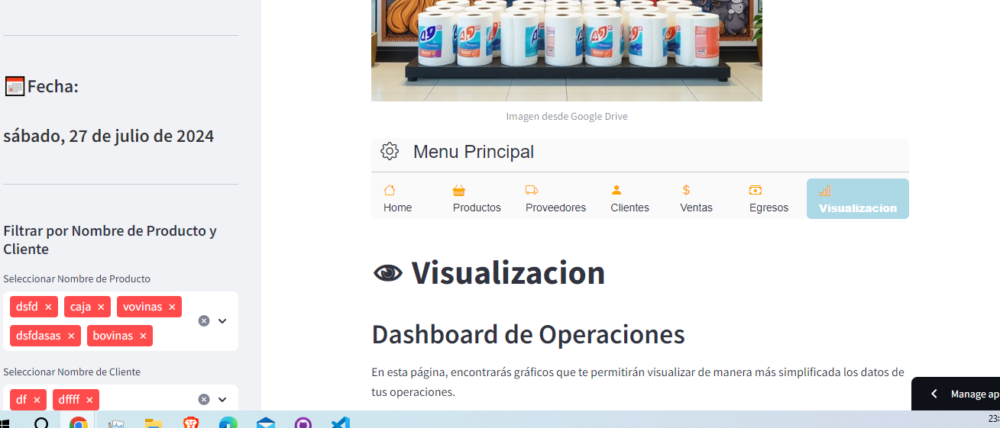
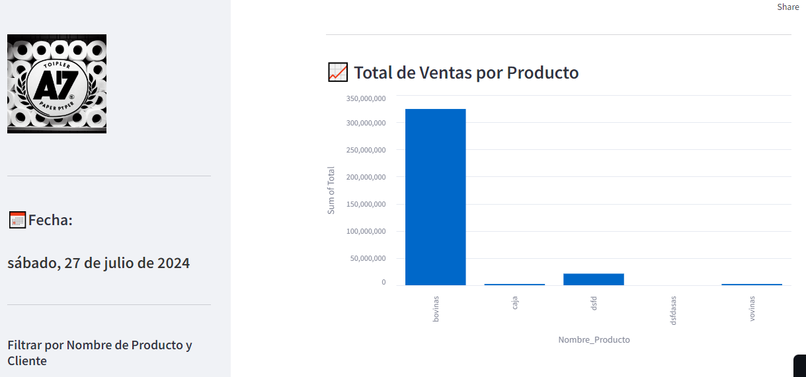

# Control de Comercio:
### Gestión de Control para Comercios


# Índice

1. [Funcionalidades Principales](#funcionalidades-principales)
2. [Requisitos](#requisitos)
3. [Modo de uso](#modo-de-uso)
4. [Estructura del Proyecto](#estructura-del-proyecto)
5. [Imagenes](#images)
6. [Archivos Principales](#archivos-principales)
7. [Notas](#notas)
8. [Contacto](#contacto)
9. [Tecnologías utilizadas](#tecnolog%C3%ADas-utilizadas)

La aplicación está diseñada para ofrecer una gestión integral de las operaciones comerciales, optimizando el control de inventario, las relaciones con clientes y proveedores, y proporcionando herramientas para un análisis financiero y operativo detallado.

## Funcionalidades Principales

1. **Gestión de Productos:**
   - **Agregar y Visualizar Productos:** Permite ingresar nuevos productos y consultar información detallada sobre los productos existentes, incluyendo cantidad disponible, precios y otros detalles importantes.
   - **Control de Stock:** Facilita el seguimiento del inventario, ayudando a mantener un control preciso sobre la cantidad de productos en existencia y evitando desabastecimientos.

2. **Gestión de Clientes y Proveedores:**
   - **Registrar y Consultar Clientes:** Agrega y gestiona información detallada de los clientes, tanto personas físicas como empresas. Incluye datos de contacto y ubicación para mejorar la comunicación y las relaciones comerciales.
   - **Administración de Proveedores:** Registro y consulta de proveedores, incluyendo detalles como número de teléfono, dirección y contacto para una comunicación efectiva y una gestión eficiente de las relaciones con los proveedores.

3. **Control de Inventario:**
   - **Seguimiento de Inventario:** Mantiene un control detallado del inventario, permitiendo la actualización de existencias y la gestión de niveles de stock. Facilita la identificación de productos que requieren reposición.

4. **Gestión Financiera:**
   - **Visualización de Gastos y Cobros:** Muestra listas de gastos y cobros asociados a los procesos comerciales, permitiendo el filtrado y la visualización de datos financieros para un análisis más claro.
   - **Creación de Tipos de Gastos y Cobros:** Permite la adición de nuevos tipos de gastos y cobros directamente desde la interfaz para una gestión financiera más flexible.

5. **Análisis y Exportación de Datos:**
   - **Exportación a Excel:** Los datos filtrados pueden ser descargados en formato Excel, facilitando un análisis adicional y la generación de reportes personalizados.
   - **Visualización de Datos en Gráficos:** Ofrece gráficos y otras formas de visualización de datos para facilitar el análisis y la toma de decisiones rápidas basadas en la información disponible.


## Requisitos

Asegúrate de tener Python 3.x instalado y las siguientes bibliotecas requeridas:

- Pandas
- Streamlit


Puedes instalar las dependencias con el siguiente comando:

```
pip install pandas streamlit
```

## Modo de uso

### Cómo Inicializar en tu PC.

Para ejecutar esta aplicación en tu máquina local, sigue estos pasos:

1. Clona este repositorio en tu sistema local.
```
    git clone <URL-del-repositorio>
    cd nombre-del-repositorio
```

2. **Instalar Dependencias:**

    Asegúrate de tener Python y pip instalados. Luego, instala las dependencias necesarias ejecutando:
```
    pip install -r requirements.txt
```
3. **Ejecutar la Aplicación:**

    Una vez que todas las dependencias estén instaladas, puedes ejecutar la aplicación usando Streamlit:

```
    streamlit run main.py
```

4. **Interactuar con la Aplicación:**

    Abre tu navegador y visita http://localhost:8501 para ver y utilizar la aplicación.


    


## Estructura del Proyecto

La aplicación está organizada en varias secciones, cada una con funcionalidades específicas para gestionar y analizar datos. A continuación, se describen las principales secciones y sus características:

**1. Productos:**

- Proporciona información relevante sobre los productos, incluyendo la cantidad disponible, precios y otros detalles importantes para la gestión de inventarios.

**2. Proveedores:**

- Incluye detalles como el número de teléfono, dirección y contacto para mantener una comunicación efectiva con los proveedores.

**3. Clientes:**

- Ofrece información detallada sobre los clientes, incluyendo su información de contacto y ubicación para mejorar las relaciones comerciales.

**4. Egresos:**

- Detalla cada gasto realizado en el negocio, proporcionando una visión clara de los costos operativos.

**5. Ventas:**

- Proporciona información detallada sobre las ventas realizadas, incluyendo la cantidad vendida, cliente asociado y otros datos relevantes para un análisis exhaustivo de las operaciones comerciales.

**6. Visualización:**

- Ofrece gráficos y otras formas de visualización de los datos para facilitar el análisis y la toma de decisiones sobre el negocio.


## Imagenes







## Archivos Principales

**main.py:** 
  
  - Archivo principal que contiene el código de la aplicación.

**Archivos Excel (.xlsx):**
   - Clientes.xlsx
   - Egresos.xlsx
   - Egresos_Agregados.xlsx
   - Egresos_Creados.xlsx
   - Productoa.xlsx
   - Proveedores.xlsx
   - Ventas.xlsx
   - Imágenes (.jpg y .png): Utilizadas en la interfaz de usuario.


## Notas

Asegúrate de mantener actualizados los archivos Excel en el directorio raíz del proyecto para que la aplicación funcione correctamente.

## Contacto

### Blas Fernando Pacios

[   
](https://www.linkedin.com/in/blas-fernando-pacios) 
[
](https://wa.me/5493815467488)

## Tecnologías utilizadas


---


